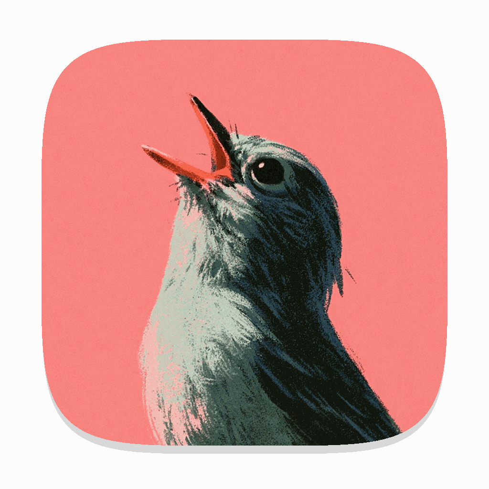

<p align="center">
  
</p>

# Chinwag

Chinwag is local push-to-talk dictation for macOS.

Hold **Option-Space**, speak, then release. Cohere Transcribe runs on Apple Metal and pastes the text where you started.

## Install

You need Apple silicon, macOS 14 or newer, [mise](https://mise.jdx.dev/), and Xcode command-line tools.

```sh
mise install
scripts/check
scripts/service install
```

The first check downloads and verifies a pinned `transcribe.cpp` release. The first launch downloads and verifies the 1.56 GB Apache-2.0 [Cohere GGUF model](https://huggingface.co/handy-computer/cohere-transcribe-03-2026-gguf).

Grant **Microphone** and **Accessibility** access in Settings.

### Signing

`scripts/build-app` compiles the Swift app, builds its icon catalog, and signs the resulting app bundle. A fresh checkout uses an ad-hoc signature by default. If an installed Chinwag app already has a usable signing identity, later builds reuse it automatically.

To preserve macOS permission grants from the first install, list your identities and provide your own Apple Development certificate:

```sh
security find-identity -v -p codesigning
scripts/service install --sign "Apple Development: Your Name (TEAMID)"
```

Without a development certificate, use the default or pass `--adhoc`. Ad-hoc rebuilds can require granting permissions again.

## Use

1. Focus a text field.
2. Hold **Option-Space** and speak.
3. Release **Option-Space**.

Chinwag pastes into the original field. If focus changed, it leaves the text on the clipboard.

## Service

A Go service keeps Cohere loaded in memory. Quitting the menu app does not unload it.

```sh
scripts/service status
scripts/service uninstall
```

The app is installed in `~/Applications`. Runtime files are in `~/.local/share/chinwag/runtime`, the model is in `~/.local/share/chinwag/models`, and logs are in `~/.local/state/chinwag`.

## Transcription API

Chinwag exposes an OpenAI-compatible transcription endpoint for native apps and command-line clients:

```text
Base URL  http://127.0.0.1:3212/v1
POST      /audio/transcriptions
Health    http://127.0.0.1:3212/healthz
```

Use `whisper-1` as the client model. Chinwag does not require an API key; clients that require a value can use a non-secret placeholder such as `not-needed`.

The service listens only on loopback and rejects browser-originated transcription requests. For remote tailnet access, proxy it with Tailscale Serve and grant access only to the intended client:

```sh
tailscale serve --bg --https=8443 http://127.0.0.1:3212
```

Chinwag has no HTTP authentication. Keep the listener private, use narrow network access controls, and never use Tailscale Funnel.

## Limits

Audio stays on the Mac. Temporary recordings are removed. Audio and transcript text are not logged. Recordings can be up to 25 MiB and ten minutes.

## License

Chinwag is available under the [MIT License](LICENSE). The vendored `transcribe.cpp` header retains its included MIT license.
